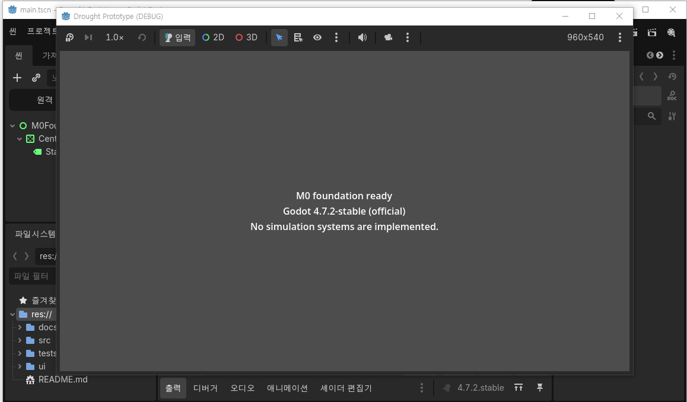

# M0 Windows GUI 검증 기록

## 검증 대상

```text
DATE = 2026-09-01
PLATFORM = WINDOWS X86_64
ENGINE = GODOT 4.7.2 STABLE STANDARD
BRANCH = fix/m0-review-debt
CANDIDATE COMMIT = b3c0faf06e98accba7d01745a67d255afce91b0c
METHOD = GODOT EDITOR에서 project.godot을 열고 F5 실행
```

## 관측 결과

사용자가 Windows Godot 편집기에서 프로젝트를 열고 `F5`를 실행했다. 실행 창에는 다음 상태가 표시됐다.

```text
M0 foundation ready
Godot 4.7.2-stable (official)
No simulation systems are implemented.
```



## 판정

```text
GODOT EDITOR EXECUTION = PASS
WINDOWS F5 EXECUTION = PASS
M0 GUI EVIDENCE = PRESENT
```

이 기록은 M0의 편집기 실행과 Windows 실행 기준만 증명한다. NPC, 가뭄, 자원, 판단 또는 다른 M1 이상의 simulation 기능은 검증하거나 주장하지 않는다.
